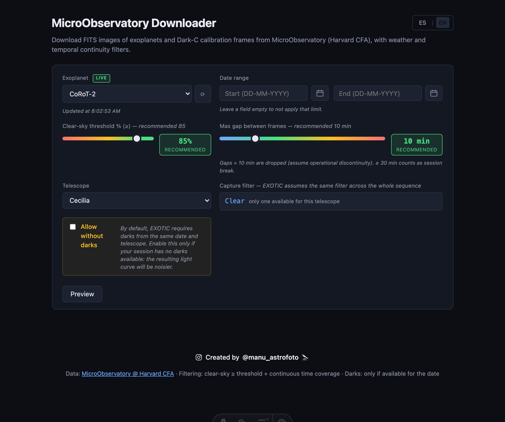
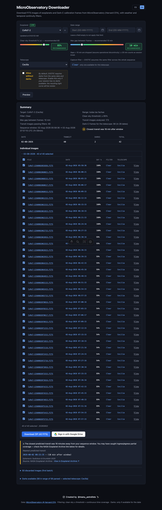
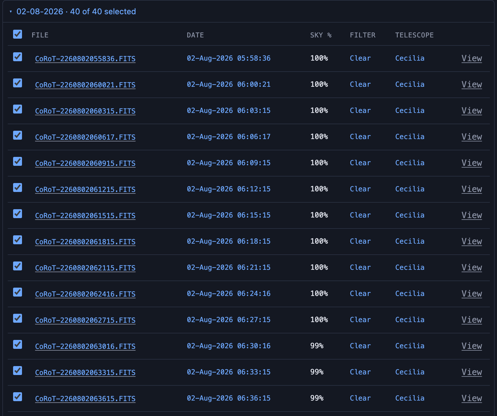
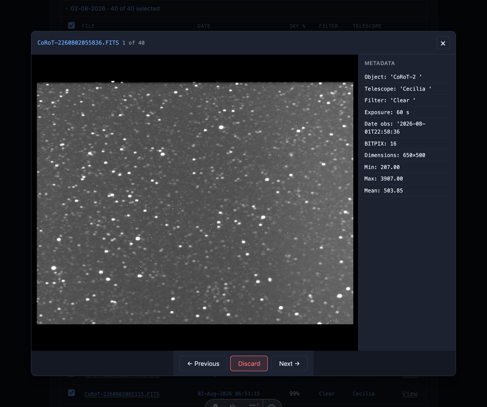

# MicroObservatory Downloader

**Select clear, continuous exoplanet FITS (+ Dark-C) from Harvard CFA MicroObservatory — ready for EXOTIC and Exoplanet Watch analysis.**

A browser app that turns MicroObservatory’s public image directory into a guided workflow: live targets, weather and temporal-continuity filters, NASA transit ephemeris checks, per-image FITS QC, then ZIP download or Google Drive upload under `EXOTIC/<target>/`.

Deployed on Netlify. Stack: Astro 5 · React · TypeScript.

---

## Why it exists

[MicroObservatory](https://mo-www.cfa.harvard.edu/) (Harvard–Smithsonian Center for Astrophysics) publishes valuable citizen-science imaging of exoplanet hosts. Preparing that data for [EXOTIC](https://github.com/rzellem/EXOTIC) / [Exoplanet Watch](https://exoplanets.nasa.gov/exoplanet-watch/) still means:

- Finding nights with enough clear-sky frames
- Dropping sequences broken by long gaps or cloudy neighbors
- Pairing lights with same-night Dark-C calibration frames
- Checking that a session actually covers a predicted transit

This app exists so observers and educators can do that work in one place: preview nights, curate frames, and export ready-to-reduce sequences without downloading whole directories and sorting them by hand.

> Independent community tool. Not an official NASA or Harvard product.

---

## What you can do

- **Live exoplanet target list** from MicroObservatory (auto-refresh ~60 s)
- **Weather + gap filters** with configurable clear-sky threshold and max inter-frame gap
- **Session grouping** that correctly handles sequences crossing midnight UTC; multi-session nights use folders like `YYYYMMDD-1`, `YYYYMMDD-2`
- **NASA Exoplanet Archive ephemeris check** — does this session contain a predicted transit midpoint?
- **Per-image checklist + FITS viewer** (server-rendered PNG stretch) to discard bad frames before download
- **ZIP download** in the browser (parallel FITS fetch via proxy)
- **Google Drive upload** to `EXOTIC/<target>/` with the same folder layout (OAuth scope `drive.file` only)
- **English / Spanish** UI

---

## Typical workflow

1. Open the app and pick an exoplanet from the live list.
2. Set date range, clear-sky threshold (recommended ≥ 85%), max gap (recommended 10 min), telescope, and capture filter (or auto).
3. Click **Preview** — review kept vs discarded frames and session groups.
4. Optionally run the **transit check** against NASA ephemerides for each session.
5. Open the **FITS viewer** from the checklist; discard frames that fail visual QC.
6. **Download ZIP** or **Sign in with Google Drive** and upload to `EXOTIC/<target>/`.
7. Point EXOTIC at the resulting folder structure and reduce as usual.

### Screenshots (demo: CoRoT-2)

**1. Configure** — live target list, clear-sky threshold, max gap, telescope, EXOTIC filter lock:



**2. Preview** — kept sessions, NASA Archive transit check, ZIP / Drive export:



**3. Per-image checklist** — select or discard individual FITS before download:



**4. FITS viewer** — stretched PNG preview, header metadata, discard / navigate:



---

## Science filters

Filter logic lives in [`src/lib/filters.ts`](src/lib/filters.ts) (TypeScript port of `download_mo.py`). Defaults:

| Rule | Transit (weather-sensitive) | Dark-C |
|---|---|---|
| Clear-sky | Discard if weather is below threshold (default inclusive: keep if ≥ threshold) | No weather filter |
| Small gap (4 → max-gap min) | Discard if neighbor is cloudy | — |
| Medium gap (max-gap → 30 min) | Discard always (operational discontinuity) | Medium gaps marked bad |
| Gap ≥ 30 min | Session break — OK (starts a new session) | Same session break |
| Global | A date/session is downloadable only if it has transit frames **and** darks for the chosen telescope (unless “Allow without darks”) | Same-night, same telescope |

**Configurable max gap** (`badGapMid`, UI default **10 min**): raising it tolerates longer operational pauses (slew, refocus) before treating a gap as a hard break.

**Sessions** are clustered by gap ≥ 30 min, not by UTC calendar date, so a night that runs 22:00 → 02:00 stays one continuous sequence.

**Capture filter:** EXOTIC expects a single filter across the sequence; the UI can lock to the most common filter or let you choose.

### Transit ephemeris check

[`POST /api/transit-check`](src/pages/api/transit-check.ts) queries the [NASA Exoplanet Archive](https://exoplanetarchive.ipac.caltech.edu/) TAP table `ps`, then predicts midpoints with \(t_n = t_0 + n\,P\). When multiple ephemerides exist, the app picks the **most precise** for the query epoch (propagated uncertainty), and reports whether a midpoint falls inside (or near) the session window. Name matching handles MO ↔ NASA variants (e.g. `HAT-P` ↔ `HATP`).

---

## Data sources

| Source | Role |
|---|---|
| [MO Image Directory](https://waps.cfa.harvard.edu/microobservatory/MOImageDirectory/ImageDirectory.php) | Live target list and HTML row metadata |
| [MO FITS host](https://mo-www.cfa.harvard.edu/ImageDirectory/) | Raw FITS download (proxied) |
| [NASA Exoplanet Archive TAP](https://exoplanetarchive.ipac.caltech.edu/TAP/sync) | Transit ephemerides (`ps`) |
| Google Drive API | Optional upload; scope **`drive.file`** — the app only sees files it creates |

---

## Quick start

```bash
cp .env.example .env   # set PUBLIC_GOOGLE_CLIENT_ID if you need Drive upload
npm install
npm run dev            # http://localhost:4321
```

Useful scripts:

| Command | Purpose |
|---|---|
| `npm run dev` | Astro dev server |
| `npm run build` | Production build → `dist/` |
| `npm run netlify` | Local Netlify (Functions + Edge) |
| `npm test` | Vitest unit tests |

---

## Architecture

```
src/
├── pages/
│   ├── index.astro                 # Main UI
│   └── api/
│       ├── preview.ts              # POST: filter + session groups (no FITS bytes)
│       ├── targets.ts              # GET: live exo list from MO
│       ├── transit-check.ts        # POST: NASA TAP ephemeris match
│       ├── fits/[file].ts          # GET: CORS proxy for raw FITS
│       └── fits-view/[file].ts     # GET: FITS → PNG (+ optional metadata)
├── components/
│   ├── Downloader.tsx              # Form, preview, ZIP, Drive
│   ├── ImageChecklist.tsx          # Per-frame selection
│   ├── FitsViewer.tsx              # Modal PNG viewer
│   └── Footer.tsx
├── lib/
│   ├── mo-client.ts                # MO HTML fetch/parse (HAT-P naming, SortRange)
│   ├── filters.ts                  # Weather/gap/session clustering
│   ├── transit-match.ts            # Ephemeris math + name variants
│   ├── sequence-table.ts           # Download file list helpers
│   ├── google-drive.ts             # GIS OAuth + resumable upload
│   ├── fits-parser.ts / fits-stretch.ts
│   ├── schemas.ts / cors.ts / sql-escape.ts / rate-limit.ts
│   └── i18n/                       # EN / ES dictionaries
├── middleware.ts                   # Security headers + CSP
└── styles/global.css

netlify/
└── edge-functions/rate-limit.ts    # /api/preview, /api/transit-check
```

**Client-side ZIP:** FITS are fetched through `/api/fits/...` and packed with JSZip (4 parallel workers), avoiding Netlify function body/time limits for bulk download.

---

## API

| Method | Path | Description |
|---|---|---|
| `POST` | `/api/preview` | Body: target, date range, threshold, gap, telescope, filter, darks flag. Returns session groups, kept/discarded frames, discovered telescopes/filters. |
| `GET` | `/api/targets` | Live exoplanet names from MO’s directory dropdown. |
| `POST` | `/api/transit-check` | Body: target + session `start`/`end`. Returns midpoints in/near the window vs NASA Archive. |
| `GET` | `/api/fits/{filename}` | Proxy of MO FITS with CORS allowlist (`ALLOWED_FITS_ORIGINS`). |
| `GET` | `/api/fits-view/{filename}` | Renders a stretched PNG preview; `?meta=1` for header metadata. |
| `OPTIONS` | `/api/fits/{filename}` | CORS pre-flight. |

---

## Deploy (Netlify)

```bash
npm install -g netlify-cli   # once
netlify login
netlify init
netlify deploy --prod
```

Or connect the GitHub repo in the Netlify UI:

- **Build command:** `npm run build`
- **Publish directory:** `dist`

### Environment variables

See [`.env.example`](.env.example).

| Variable | Where | Purpose |
|---|---|---|
| `PUBLIC_GOOGLE_CLIENT_ID` | Browser | Google Identity Services for Drive upload |
| `ALLOWED_FITS_ORIGINS` | Server | Comma-separated CORS allowlist for FITS proxies (deny-by-default in production) |
| `RATE_LIMIT_WINDOW_SEC` | Edge | Window length (default `60`) |
| `RATE_LIMIT_PREVIEW_MAX` | Edge | Max `/api/preview` requests per IP per window (default `30`) |
| `RATE_LIMIT_TRANSIT_CHECK_MAX` | Edge | Max `/api/transit-check` per IP per window (default `20`) |

### Google Drive setup (once)

1. [Google Cloud Console](https://console.cloud.google.com/) → enable **Google Drive API**.
2. OAuth consent screen (External or Internal) with scope `https://www.googleapis.com/auth/drive.file`.
3. Create **OAuth client ID** (Web application). Authorized JavaScript origins: `http://localhost:4321` and your Netlify URL.
4. Put the Client ID in `.env` as `PUBLIC_GOOGLE_CLIENT_ID` and restart `npm run dev`.

The app uploads individual FITS into `EXOTIC/<target>/<date>/` (and `.../darks/`), not a single ZIP — the layout EXOTIC expects. Tokens are short-lived access tokens in `localStorage` (no refresh token). Use **Disconnect** when finished.

---

## Security & limits

- **Headers / CSP** via [`src/middleware.ts`](src/middleware.ts) (`X-Frame-Options`, `Referrer-Policy`, strict CSP on HTML).
- **CORS** on FITS proxies: allowlist only; `Vary: Origin` always set.
- **Rate limiting** on preview and transit-check (Netlify Edge + Blobs); `429` + `Retry-After` when exceeded; fail-open if Blobs is unavailable.
- **Input validation** with Zod (`.strict()`); ADQL wildcards escaped for TAP queries.
- **Netlify free tier:** function time/RAM/body limits apply. Preview and transit-check only touch HTML/JSON metadata; bulk FITS stay on the client.

---

## What’s new in v0.1.0

First official release of `mo-downloader-web`.

- **In-browser FITS viewer** — stretched PNG preview, metadata, prev/next, discard before download
- **NASA transit ephemeris check** — TAP `ps` + most-precise ephemeris for the session epoch
- **Session-aware packaging** — midnight-crossing clusters; multi-session nights as `YYYYMMDD-N` folders
- **MO catalog robustness** — `HAT-P` ↔ `HATP` name bridging; `SortRange=30` (valid MO range) so targets like Qatar-9 return full lists
- **EXOTIC-oriented export** — ZIP or Google Drive under `EXOTIC/<target>/` with Dark-C sidecar folders
- **Bilingual UI** (EN / ES) and hardened API surface (Zod, CORS allowlist, edge rate limits)

---

## Credits

- **Data:** [MicroObservatory](https://mo-www.cfa.harvard.edu/) — Harvard–Smithsonian Center for Astrophysics
- **Ephemerides:** [NASA Exoplanet Archive](https://exoplanetarchive.ipac.caltech.edu/)
- **Analysis pipeline (downstream):** [EXOTIC](https://github.com/rzellem/EXOTIC) · [NASA Exoplanet Watch](https://exoplanets.nasa.gov/exoplanet-watch/)

Built for educators, citizen scientists, and anyone reducing MicroObservatory transit photometry. Feedback welcome via GitHub Issues.
